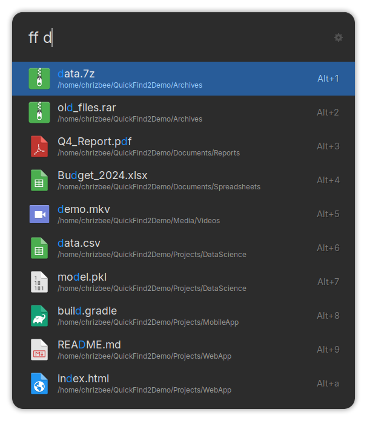
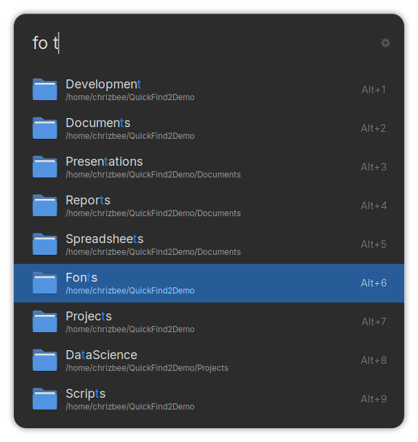
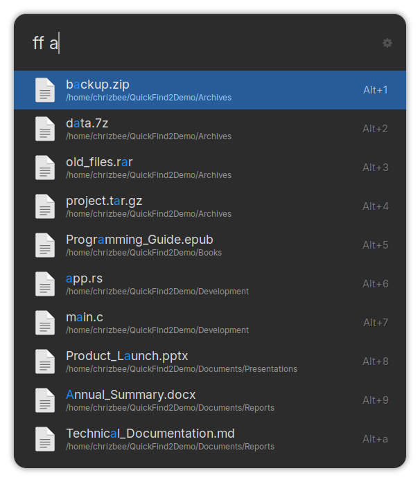

# 🔍 QuickFind2 for Ulauncher

**QuickFind2** is a blazing fast Ulauncher extension that helps you **quickly find files, folders, and more** on your computer — all from your keyboard.

**QuickFind2** was forked from JerryV22's [QuickFind](https://github.com/JerryV22/Ulauncher-quickfind).

## Features

- Find files using `ff`
- Find folders using `fo`
- Customizable search directory
- Add custom `fd` options
- Open item with LMB, open parent with RMB
- Automatically query system icons
- Lightweight and fast
- Smart fuzzy matching
- Designed for Linux based on `fd`

## Preview

With system icons:

With default icons:

##  Installation
### Requirements

- [Ulauncher](https://ulauncher.io/)
- [fd](https://github.com/sharkdp/fd)

### Steps

1. Open Ulauncher
2. Go to Settings > Extensions > Add extension
3. Paste this URL: https://github.com/chrizbee/ulauncher-quickfind2

